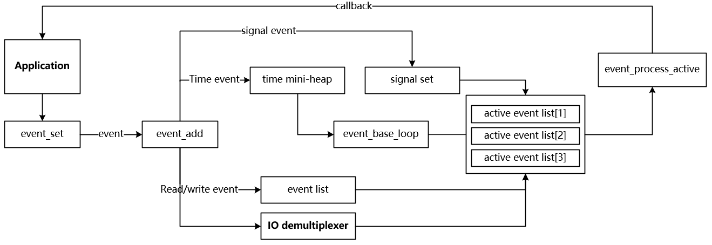

# libevent 源码解析-事件循环

最近阅读了 libevent 的源码，写一篇文章来总结自己学习到知识。使用libevent应该优先选用最新的稳定版本，而阅读源码为了降低难度，我选择了1.4的版本，也就是patches-1.4分支。读这篇文章需要 Unix 网络编程的基础，知道 reactor 模式，如果对此还有疑问可以看我这篇文章[典型服务器模式原理分析与实践](https://github.com/oscarwin/blog/blob/master/典型服务器模式原理分析与实践)

## libevent 的文件结构

关于 libevent 的文件结构这篇文章[The Libevent Reference Manual: Preliminaries](http://www.wangafu.net/~nickm/libevent-book/Ref0_meta.html)说明的比较清楚了，这里简要说明一下。

**event 和 event_base**

event 和 event_base 是 libevent 的核心，也是我们要探讨的核心，主要围绕两个结构体类型 event 和 event_base 展开，event 定义了事件的结构，event_base 则是事件循环的框架，这两个结构体分别定义在 event.h 和 event-internal.h 文件中。在 event.c 中定义了事件初始化，事件注册，事件删除等 API，还包含了事件循环框架 event base 相关的 API。

**evbuffer 和 bufferevent**

evbuffer 和 bufferevent 则处理了 libevent 中关于读写缓冲的问题，这两个结构体也定义在 event.h 头文件中，而相关 API 则分别在 buffer.c 文件和 evbuffer.c 文件中定义相关API。bufferevent 是一个缓冲区管理结构体，在其中包含了两个 evbuffer 指针，一个是读缓存区，一个是写缓存区。evbuffer 则是与底层 IO 打交道的。另外不得不提的是 bufferevent 中为读缓存区和写缓存区都设定了一个高水位和低水位，高水位是为了避免单个缓存区占用过多的内存，低水位是为了减少回调函数调用的次数，提高效率。

**IO 多路复用系统**

libevent 是跨平台的网络库，在不同平台下实现 IO 多路的方式不一样，即使在同一平台下也可能有多种实现方式，libevent 支持 select，poll，epoll，kqueue 等方式。

**util**

util 模块就是一些公共方法了，比如日志函数，时间处理函数等

## 事件

libevent 将事件进一步抽象化了，除了读和写事件，还包括定时事件，甚至将信号也转化成了事件来处理。首先看一下 event 的结构体。

1) libevent 用链表来保存注册事件和激活的事件，ev_next 是所有注册事件的链表，ev_active_next 是激活事件的链表，ev_signal_next 是信号事件的链表。时间事件用最小堆来管理，用最小堆是非常高效的方式，每次只需要判断堆顶的事件，如果堆顶的时间事件都没有就绪，那么后面的时间也一定没有就绪。

2) 每个事件循环就有一个 event_base，用来调度事件，ev_base 指向该事件所在的事件循环。

3) ev_events 则表示该事件所关心的事件类型，可以是以下几种情况：

```
// 时间事件
#define EV_TIMEOUT  0x01
// 可读事件
#define EV_READ     0x02
// 可写事件
#define EV_WRITE    0x04
// 信号
#define EV_SIGNAL   0x08
// 标识是否为永久事件。非永久事件激活一次后，就会从注册队列中删除，如果想继续监听该事件，需要再次加入事件队列。而永久事件则激活后不会从注册事件中删除，除非自己手动删除。
#define EV_PERSIST  0x10    /* Persistant event */
```

4) 如果该事件是个时间事件，那么 ev_timeout 就是这个事件的超时时长。

5) libevent 的事件可以使用优先级，优先级高的事件总是先响应，ev_pri 就是该事件的优先级。 

6) ev_callback 是该事件对应的回调函数，当事件被触发后会调用该回调函数进行处理。

```
struct event {
    /*
    ** libevent 用双向链表来保存注册的所有事件，包括IO事件，信号事件。
    ** ev_next 存储了该事件在事件链表中的位置
    ** 另外，libevent 还用另一个链表来存储激活的事件，通过遍历激活的事件链表来分发任务
    ** ev_active_next 存储了该事件在激活事件链表中的位置
    ** 类似，ev_signal_next 就是该事件在信号事件链表中的位置
    */
	TAILQ_ENTRY (event) ev_next;
	TAILQ_ENTRY (event) ev_active_next;
	TAILQ_ENTRY (event) ev_signal_next;
    /* libevent 用最小堆来管理超时时间，min_heap_idx 保存堆顶的 index */
	unsigned int min_heap_idx;	/* for managing timeouts */

    /* event_base 是整个事件循环的核心，每个 event 都处在一个 event_base 中，ev_base 保存这个结构体的指针 */
	struct event_base *ev_base;
    /* 对于 IO 事件，ev_fd 是绑定的文件描述符，对于 signal 事件，ev_fd 是绑定的信号 */
	int ev_fd;
    /* 要处理的事件类型， */
	short ev_events;
    /* 事件就绪执行时，调用ev_callback的次数，通常为1 */
	short ev_ncalls;
	short *ev_pncalls;	/* Allows deletes in callback */
    /* 事件超时的时间长度 */
	struct timeval ev_timeout;
    /* 优先级 */
	int ev_pri;		/* smaller numbers are higher priority */
    /* 响应事件时调用的callback函数 */
	void (*ev_callback)(int, short, void *arg);
	void *ev_arg;

	int ev_res;		/* result passed to event callback */
    /* 表示事件所处的状态 */
	int ev_flags;
};
```

对于事件的处理主要有三个 API：event_set，event_add，event_del

**event_set**
event_set 用来初始化一个event对象

```
void event_set(struct event *ev, int fd, short events,
      void (*callback)(int, short, void *), void *arg)
{
    /* Take the current base - caller needs to set the real base later */
    /* current_base 是一个全局变量，ev_base 会默认指向这个变量，
    ** 之后 ev_base 也可以通过 event_base_set 设置指向指定的 event_base 
    ** 特别是对于一个进程中有多个 event_base 的情况下，需要绑定到指定的 event_base 上*/
    ev->ev_base = current_base;

    ev->ev_callback = callback;
    ev->ev_arg = arg;
    ev->ev_fd = fd;
    ev->ev_events = events;
    ev->ev_res = 0;
    ev->ev_flags = EVLIST_INIT;
    ev->ev_ncalls = 0;
    ev->ev_pncalls = NULL;

    min_heap_elem_init(ev);

    /* by default, we put new events into the middle priority */
    /* 设定默认优先级为最大优先级的一半 */
    if(current_base)
        ev->ev_pri = current_base->nactivequeues/2;
}
```

**event_add**
event_add 则是像事件队列中添加注册的事件，如果该事件监听在读事件、写事件或者信号上，那么就会将其先添加到IO多路复用系统中，然后再加入到注册事件链表中。如果参数 tv 不为 NULL，还会将该事件注册到时间事件的最小堆上。
```
int event_add(struct event *ev, const struct timeval *tv)
{
    // 要注册的evbase
    struct event_base *base = ev->ev_base;
    const struct eventop *evsel = base->evsel;
    void *evbase = base->evbase;
    int res = 0;

    event_debug((
         "event_add: event: %p, %s%s%scall %p",
         ev,
         ev->ev_events & EV_READ ? "EV_READ " : " ",
         ev->ev_events & EV_WRITE ? "EV_WRITE " : " ",
         tv ? "EV_TIMEOUT " : " ",
         ev->ev_callback));

    // 校验没有设其他的标志位
    assert(!(ev->ev_flags & ~EVLIST_ALL));

    /*
     * prepare for timeout insertion further below, if we get a
     * failure on any step, we should not change any state.
     */
    // 分配最小堆插入一个元素的内存，先分配内存是为了保证时间事件
    if (tv != NULL && !(ev->ev_flags & EVLIST_TIMEOUT)) {
        if (min_heap_reserve(&base->timeheap,
            1 + min_heap_size(&base->timeheap)) == -1)
            return (-1);  /* ENOMEM == errno */
    }

    /* ev_events 监听的事件类型为读写或者信号 而且 该事件没有被注册过，也不在激活队列里 */
    if ((ev->ev_events & (EV_READ|EV_WRITE|EV_SIGNAL)) &&
        !(ev->ev_flags & (EVLIST_INSERTED|EVLIST_ACTIVE))) {
        /* 将事件注册到 IO 多路复用中 */
        res = evsel->add(evbase, ev);
        if (res != -1)
            /* 注册成功后将事件加入到 event_base 的事件链表中 */
            event_queue_insert(base, ev, EVLIST_INSERTED);
    }

    /* 
     * we should change the timout state only if the previous event
     * addition succeeded.
     */
    if (res != -1 && tv != NULL) {
        struct timeval now;

        /* 
         * we already reserved memory above for the case where we
         * are not replacing an exisiting timeout.
         */
        /* 如果事件已经在定时事件中了，则从时间事件链表中删除该事件 */
        if (ev->ev_flags & EVLIST_TIMEOUT)
            event_queue_remove(base, ev, EVLIST_TIMEOUT);

        /* Check if it is active due to a timeout.  Rescheduling
         * this timeout before the callback can be executed
         * removes it from the active list. */
        /* 如果事件已经在激活队列中，则从激活队列中删除该事件 */
        if ((ev->ev_flags & EVLIST_ACTIVE) &&
            (ev->ev_res & EV_TIMEOUT)) {
            /* See if we are just active executing this
             * event in a loop
             */
            if (ev->ev_ncalls && ev->ev_pncalls) {
                /* Abort loop */
                *ev->ev_pncalls = 0;
            }
            
            event_queue_remove(base, ev, EVLIST_ACTIVE);
        }
        // 获取当前时间
        gettime(base, &now);
        // 计算超时时间
        evutil_timeradd(&now, tv, &ev->ev_timeout);

        event_debug((
             "event_add: timeout in %ld seconds, call %p",
             tv->tv_sec, ev->ev_callback));
        // 插入到定时时间事件队列中
        event_queue_insert(base, ev, EVLIST_TIMEOUT);
    }

    return (res);
}
```

## 事件循环

介绍完事件则介绍一下事件调度的核心 event_base，event_base 定义在头文件 event-internal.h 中。

首先在 event_base 中有一个成员 evsel，该成员保存了 IO 多路复用资源的函数指针，eventop 的结构如下：

```
struct eventop {
    const char *name;
    void *(*init)(struct event_base *);
    int (*add)(void *, struct event *);
    int (*del)(void *, struct event *);
    int (*dispatch)(struct event_base *, void *, struct timeval *);
    void (*dealloc)(struct event_base *, void *);
    /* set if we need to reinitialize the event base */
    int need_reinit;
};
```

对于每一种 IO 多路复用都实现了 init, add, del, dispatch 几种方法，init 就是初始化，add 就是添加事件，del 就是删除事件，diapatch 的就等待事件被激活，并分别处理激活的事件。在 event_base 中还有一个成员 evbase，这个成员保存了 IO 多路复用的资源。比如 add 函数的第一个参数是 void*，这个 void* 就是要传入 evbase 的。实际上这种做法就是通过 C 的函数指针来实现了多态，如果是面向对象的语言就不用搞这么复杂了。不过这种 C 实现多态的方法还是值得我们学习的。

event_base 中有一个成员 activequeues 需要说明一下，这是一个指向指针的指针。之前说过激活队列是有优先级的，同一优先级的激活事件放在一个链表中，那么多个不同优先级的激活队列的头节点也就组成了一个队列。因此，这里是指向指针的指针。

```
struct event_base {
    /* eventop 对象指针，决定了使用哪种IO多路复用资源 
    ** 但是 eventop 实际上只保存了函数指针，最后资源的句柄是保存在 evbase 中。
    ** 比如要使用 epoll，那么就应该有一个 epoll 的文件描述符，eventop 中只保存了epoll相关的add，del等函数
    ** epoll 的文件描述符是保存在 evbase 中的，因此调用的形式就是 evsel->add(evbase, ev);
    */
    const struct eventop *evsel;
    void *evbase;
    /* event base 上所有事件的数量包括注册事件和激活事件
    ** 在 event_queue_insert 函数中加 1 */
    int event_count;        /* counts number of total events */
    /* event base 上被激活的事件的数量 */
    int event_count_active; /* counts number of active events */

    int event_gotterm;      /* Set to terminate loop */
    int event_break;        /* Set to terminate loop immediately */

    /* active event management */
    /* libevent 支持事件的优先级，对于激活的事件，不同优先级的事件存储在不同的链表中 
    ** 然后再用一个链表把这些链表串起来
    */
    struct event_list **activequeues;
    /* 事件可以设定的最大优先级 */
    int nactivequeues;

    /* signal handling info */
    struct evsignal_info sig;
    /* 保存所有注册事件的链表 */
    struct event_list eventqueue;
    /* 上一次进行事件循环的时间 */
    struct timeval event_tv;
    /* 管理时间事件的小顶堆 */
    struct min_heap timeheap;

    struct timeval tv_cache;
};
```

关于 event_base 主要相关的有以下几个函数：event_base_new，event_base_free，event_base_loop

event_base_new 和 event_base_free 分别就是分配 event_base 资源和释放 event_base 资源，比较好理解。通过 event_base_new 首先创建 event_base，然后创建不同的事件并注册到 event_base 中，最后通过 event_base_loop 启动事件循环。如果要退出事件循环，可以调用 event_base_loopbreak 或 event_loopexit_cb。

事件循环的核心是调用 IO 复用的 dispatch 函数，需要注意的是在调用 dispatch 函数之前会先计算出最近一个时间事件距离现在还有多久，然后将这个时间差作为 dispatch 阻塞的时间，这样时间事件就可以被及时响应，不会因为阻塞在 IO 多路复用上太久而等待太多时间。这是一种常见的做法，redis 的事件循环也是这样实现的。
```
int
event_base_loop(struct event_base *base, int flags)
{
    const struct eventop *evsel = base->evsel;
    void *evbase = base->evbase;
    struct timeval tv;
    struct timeval *tv_p;
    int res, done;

    /* clear time cache */
    base->tv_cache.tv_sec = 0;

    if (base->sig.ev_signal_added)
        evsignal_base = base;
    done = 0;
    while (!done) {
        /* Terminate the loop if we have been asked to */
        /* 调用 event_loopexit_cb 跳出循环，为什么搞了两个函数？ */
        if (base->event_gotterm) {
            base->event_gotterm = 0;
            break;
        }

        /* 调用 event_base_loopbreak 函数跳出循环 */
        if (base->event_break) {
            base->event_break = 0;
            break;
        }

        /* You cannot use this interface for multi-threaded apps */
        while (event_gotsig) {
            event_gotsig = 0;
            if (event_sigcb) {
                res = (*event_sigcb)();
                if (res == -1) {
                    errno = EINTR;
                    return (-1);
                }
            }
        }

        /* 矫正时间 */
        timeout_correct(base, &tv);

        tv_p = &tv;
        /* 如果没有激活事件，且等待方式不是非阻塞，计算当前时间距离最小堆堆顶时间事件的时间差，作为阻塞的时间 */
        if (!base->event_count_active && !(flags & EVLOOP_NONBLOCK)) {
            timeout_next(base, &tv_p);
        } else {
            /* 
             * if we have active events, we just poll new events
             * without waiting.
             */
            /* 如果有激活事件，将阻塞时间设置为 0 */
            evutil_timerclear(&tv);
        }
        
        /* If we have no events, we just exit */
        /* 如果已经没有事件了，则退出循环 */
        if (!event_haveevents(base)) {
            event_debug(("%s: no events registered.", __func__));
            return (1);
        }

        /* update last old time */
        /* 更新事件循环的时间 */
        gettime(base, &base->event_tv);

        /* clear time cache */
        /* 清空时间缓存 */
        base->tv_cache.tv_sec = 0;
        /* 调用 IO 多路复用函数等待事件就绪，就绪的信号事件和IO事件会被插入到激活链表中 */
        res = evsel->dispatch(base, evbase, tv_p);

        if (res == -1)
            return (-1);
        /* 写时间缓存 */
        gettime(base, &base->tv_cache);
        /* 检查heap中的时间事件，将就绪的事件从heap中删除并插入到激活队列中 */
        timeout_process(base);
        /* 如果有激活的信号事件和IO时间，则处理 */
        if (base->event_count_active) {
            event_process_active(base);
            if (!base->event_count_active && (flags & EVLOOP_ONCE))
                done = 1;
        } else if (flags & EVLOOP_NONBLOCK)
            /* 如果采用非阻塞的方式 */
            done = 1;
    }

    /* clear time cache */
    base->tv_cache.tv_sec = 0;

    event_debug(("%s: asked to terminate loop.", __func__));
    return (0);
}
```


## 总结

libevent 的事件循环的核心就是以上描述的这些了，对于细节地方的实现在我的 github 上给出了相应的中文注释。另外，网络上有一副图很直观的描述了 libevent 的事件循环，我将其重新画了一遍，稍微修改了一下，贴出来和大家交流。

