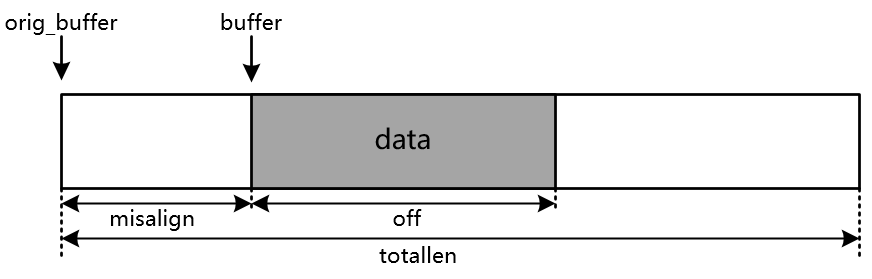

# Libevent 源码解析-evbuffer

在 [Libevent 源码解析-事件循环]() 一文中已经介绍了事件循环的主要逻辑，这篇文章再聊一下 libevent 的另一个核心——输入输出缓冲区。对于每一个通过 accept 连接的套接字，无非对其就是两种操作，一个是向套接字写数据，一个是从套接字读数据，对应就是读事件和写事件。libevent 为每个文件描述符就建立了一个输入缓冲区和一个输出缓冲区，分别用来读数据和写数据。缓冲区的结构被定义 evbuffer。然后用另一个结构体来管理这两个缓冲区，这个结构体就是 bufferevent。

## bufferevent

首先看一下 bufferevent 的定义，该结构也定义在 event.h 文件中：

```
struct bufferevent {
    /* bufferevent 关联的 event_base */
	struct event_base *ev_base;
    /* 一个bufferevent里同时维护相关于这个buffer的读事件和写事件 */
    /* 读事件 */
	struct event ev_read;
    /* 写事件 */
	struct event ev_write;

    /* 维护两个buffer，读和写 */
	struct evbuffer *input;
	struct evbuffer *output;

    /* 读和写的水位 */
	struct event_watermark wm_read;
	struct event_watermark wm_write;

    /* 读和写已经错误处理的callback函数 */
	evbuffercb readcb;
	evbuffercb writecb;
	everrorcb errorcb;
	void *cbarg;

    /* 读写阻塞的超时时间 */
	int timeout_read;	/* in seconds */
	int timeout_write;	/* in seconds */

	short enabled;	/* events that are currently enabled */
};
```

bufferevent 里维护了一个读事件 ev_read 和一个写事件 ev_write，一个读缓冲区 input 和一个写缓冲区 output。读事件被激活后会调用 bufferevent_readcb 函数，从套接字中读数据然后写到 input 中，写事件被激活后会调用 bufferevent_writecb 函数，从缓冲区中取数据写到套接字中。

wm_read 和 wm_write 是为读缓冲区和写缓冲区设定的水位值，水位值有一个高水位和一个低水位。这个作用后面具体说明。

readcb，writecb 和 errorcb 分别是用户注册的读回调、写回调和错误回调函数。

timeout_read 和 timeout_write 就是读写的超时时间，可以不设定。

enabled 用来控制这个 bufferevent 是否处于可用状态。

与 bufferevent 相关的函数主要有 bufferevent_new，bufferevent_setcb，bufferevent_setwatermark，bufferevent_readcb，bufferevent_writecb。

bufferevent_new 用来创建 bufferevent 对象，代码如下：

```
struct bufferevent *
bufferevent_new(int fd, evbuffercb readcb, evbuffercb writecb,
    everrorcb errorcb, void *cbarg)
{
	struct bufferevent *bufev;

	if ((bufev = calloc(1, sizeof(struct bufferevent))) == NULL)
		return (NULL);

    /* 分配输入缓存区 */
	if ((bufev->input = evbuffer_new()) == NULL) {
		free(bufev);
		return (NULL);
	}

    /* 分配输出缓存区 */
	if ((bufev->output = evbuffer_new()) == NULL) {
		evbuffer_free(bufev->input);
		free(bufev);
		return (NULL);
	}

    /* 为这个 evbuffer 初始化一个读事件和一个写事件 
    ** 读事件绑定到 evbuffer 的 ev_read 成员上，
    ** 写事件绑定到 evbuffer 的 ev_write 成员上
    ** 读事件的回调函数为 bufferevent_writecb, 写事件的回调函数为 bufferevent_readcb */
	event_set(&bufev->ev_read, fd, EV_READ, bufferevent_readcb, bufev);
	event_set(&bufev->ev_write, fd, EV_WRITE, bufferevent_writecb, bufev);

    /* 为 bufferevent 设定 callback 函数 */
	bufferevent_setcb(bufev, readcb, writecb, errorcb, cbarg);

	/*
	 * Set to EV_WRITE so that using bufferevent_write is going to
	 * trigger a callback.  Reading needs to be explicitly enabled
	 * because otherwise no data will be available.
	 */
	bufev->enabled = EV_WRITE;

	return (bufev);
}
```

在 bufferevent_new 函数中创建了输入缓冲区和输出缓冲区，并创建了读事件和写事件，读事件和写事件的回调函数分别是 bufferevent_readcb 和 bufferevent_writecb。我们再看看这两个回调函数是怎么工作的？不过在此之前还是先看看缓冲区 evbuffer 的结构。

```
struct evbuffer {
    // 缓存区指针
	u_char *buffer;
    // 永远指向 buffer 的最初的起始位置
	u_char *orig_buffer;
    // 数据相对于buffer起始位置的偏移，misalign + off = totallen
	size_t misalign;
    // buffer 的总长度
	size_t totallen;
    // buffer 中存在数据的大小
	size_t off;
    // callback 函数
	void (*cb)(struct evbuffer *, size_t, size_t, void *);
	void *cbarg;
};
```

evbuffer 中，buffer 指向数据再 buffer 中的位置，orig_buffer 则永远指向 buffer 的起始位置，misalign 是 buffer 与 orig_buffer 之间的距离，off 是数据的长度，totallen 是整个 buffer 的长度。用一张图来表示的话就是下面这个样子。



```
static void
bufferevent_readcb(int fd, short event, void *arg)
{
	struct bufferevent *bufev = arg;
	int res = 0;
	short what = EVBUFFER_READ;
	size_t len;
	int howmuch = -1;

	if (event == EV_TIMEOUT) {
		what |= EVBUFFER_TIMEOUT;
		goto error;
	}

	/*
	 * If we have a high watermark configured then we don't want to
	 * read more data than would make us reach the watermark.
	 */
    /* 如果设置了高水位 */
	if (bufev->wm_read.high != 0) {
        /* 计算当前偏移量离高水位的距离 */
		howmuch = bufev->wm_read.high - EVBUFFER_LENGTH(bufev->input);
		/* we might have lowered the watermark, stop reading */
        /* 已经达到了高水位，为了降低水位，*/
		if (howmuch <= 0) {
            /* 获取输入缓冲区 */
			struct evbuffer *buf = bufev->input;
            /* 删除读事件 */
			event_del(&bufev->ev_read);
			/* 给evbuffer设定callback函数bufferevent_read_pressure_cb，当evbuffer的off发生变化时都会调用该函数 */
			evbuffer_setcb(buf,
			    bufferevent_read_pressure_cb, bufev);
			return;
		}
	}

	/* evbuffer 从套接字中读取数据，由于采用的是水平触发，所以不用一次性全部读完
	** evbuffer 采用的是读最多多少个字节，没有读完的数据还会继续触发 */
	res = evbuffer_read(bufev->input, fd, howmuch);
	if (res == -1) {
		// 没有数据可读或者信号中断，跳转到reschedule，将读事件重新加入到事件循环中
		if (errno == EAGAIN || errno == EINTR)
			goto reschedule;
		/* error case */
		// 否则就是其他错误，调用错误处理函数
		what |= EVBUFFER_ERROR;
	} else if (res == 0) {
		/* eof case */
		what |= EVBUFFER_EOF;
	}

	if (res <= 0)
		goto error;

	/* 将读事件加入到事件循环中，如果将事件指定为persist，就不用重复加了 */
	bufferevent_add(&bufev->ev_read, bufev->timeout_read);

	/* See if this callbacks meets the water marks */
	len = EVBUFFER_LENGTH(bufev->input);
	/* 如果低水位不为0，且当前数据长度没有达到低水位，那么就不调用用户注册的处理函数 */
	if (bufev->wm_read.low != 0 && len < bufev->wm_read.low)
		return;
	/* 高水位不为0，且这一次读操作后导致数据超过了高水位，则从事件循环中删除读操作 */
	if (bufev->wm_read.high != 0 && len >= bufev->wm_read.high) {
		struct evbuffer *buf = bufev->input;
		event_del(&bufev->ev_read);

		/* Now schedule a callback for us when the buffer changes */
		evbuffer_setcb(buf, bufferevent_read_pressure_cb, bufev);
	}

	/* Invoke the user callback - must always be called last */
	/* 调用用户注册的读回调函数 */
	if (bufev->readcb != NULL)
		(*bufev->readcb)(bufev, bufev->cbarg);
	return;

 reschedule:
	bufferevent_add(&bufev->ev_read, bufev->timeout_read);
	return;

 error:
	(*bufev->errorcb)(bufev, what, bufev->cbarg);
}
```