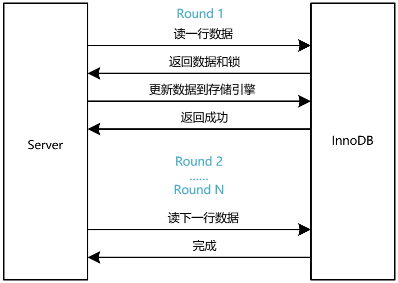

在后端技术栈中，MySQL 是最重要的一个技术栈之一，在工作中用的非常多，而且在面试中考察的也非常多。而想要深入的了解 MySQL，首先要了解 MySQL 的架构以及 SQL 语句是如何被执行的，了解了 MySQL 里语句的执行过程对 MySQL 的索引、锁等的理解会容易的多。

# MySQL的架构

MySQL 的架构图如下所示，主要由以下几个部分组成：连接器，缓存，分析器，优化器，执行器和存储引擎。


MySQL 可以分为 server 层和存储引擎层，server 层包括连接器、分析器、优化器和执行器，主要负责 SQL 语法的解析，内置函数的实现，触发器，视图等。存储引擎层负责数据的存储和提取，存储引擎是插件式的，MySQL 支持的存储引擎有 InnoDB、MyISAM、Memory 等。从 MySQL-5.5 版本开始，InnoDB 成为了 MySQL 的默认存储引擎。

## 连接器

连接器负责与客户端建立网络连接、校验用户名密码、校验用户权限、维持和管理连接等。

网络连接建立后，首先验证用户名和密码，用户名和密码验证通过以后连接器会到权限表里查询该用户的权限。之后，这个连接里的权限判断逻辑，都将依赖于此时读到的权限。这就意味着，一个用户成功连接后，再去修改该用户的权限，也不会影响到已经建立好的连接，只有重新建立连接权限才会生效。

MySQL 的网络连接采用的是多线程模型，维护一个线程池，每当有一个新的连接请求时，就从空闲的线程池中选择一个线程进行处理。可以使用 show processlist 命令查看到当前所建立的所有连接，可以看到如下的信息：

```
mysql-> show processlist
+------------+--------------+--------------------+------------------+---------+-------+-------+------------------+
| Id         | User         | Host               | db               | Command | Time  | State | Info             |
+------------+--------------+--------------------+------------------+---------+-------+-------+------------------+
| 1801071833 | user_name    | 10.1.1.1:49788     | test_db          | Sleep   |   131 |       | NULL             |  
| 2309292411 | user_name    | 10.1.1.1:57642     | test_db          | Query   |     0 | NULL  | show processlist |
```

Id 表示建立连接的线程 Id。客户端如果一段时间没有动作，Command 一栏就会显示 Sleep，表示该连接处于空闲状态。
多线程的模型必然存在连接数有限的问题，因此客户端如果太长时间没有动静，连接器就会自动断开，回收线程。

## 缓存

连接建立后，就可以执行查询语句。查询语句首先会查询缓存中是否该语句的缓存结果，因为 MySQL 查询语句的执行结果可能会已 K-V 的形式存储在缓存中，SQL 语句做KEY，查询的结果做值。

但是 MySQL 自带的缓存不建议使用，因为 MySQL 的缓存失效的非常频繁，只要对一个表有更新，那么这个表上所有的缓存都会失效，因此缓存命中率很低。不如在业务层用 Redis 或者 Memcached 做缓存来的灵活高效。

## 分析器

如果缓存没有命中或者没用使用缓存，查询语句就会到达分析器，分析器就是一个编程语言的解析器，解析的是 SQL 语言。分析器的工作主要分为两个部分：

1 词法分析：词法分析时分析器会分析 SQL 语句中每个用空格或者逗号分割的字符串，把 SELECT 关键词提取出来，把语句里的标识为表名的字符串对应到 MySQL 的表，把每一个 column 对应到表里的字段。因此，如果表名写错了，或者查询的字段不存在，都是在分析器这里就返回错误了。

2 语法分析：语法分析就是整个 SQL 语句是否满足语法要求，满足则能执行成功，不满足则报错。

## 优化器

优化器的功能一句话就能描述，却非常重要，决定了查询的性能。优化器是在表里面有多个索引的时候，决定使用哪个索引；或者在联表查询时决定用哪一张表关联哪一张表。

假设你建立了一个联合索引 key k(a, b)，而你查询语句是这样写的 select * from t where b = 1 and a = 2。那么这时候会命中索引 k 吗？答案是肯定，因为优化器会调整 where 条件的顺序来找到最佳的搜索方式，因此最后会命中索引 k。

## 执行器

执行器的功能就是调用存储引擎的 API 存入数据或者取出数据。在调用存储引擎的 API 之前会先进行权限校验，校验该用户是否有对该表相应的操作权限。存储引擎如果索引没有命中，存储引擎就一条条扫表，直到查到指定的数据，然后返回给 serve 层。如果命中了索引，存储引擎就在索引命中的数据中一条条扫描，直到查到指定的数据。如果索引类型为 const 类型，那么存储引擎会直接命中，然后返回。

# 查询语句如何实现

说完了MySQL的架构，我们用一个例子来总结一下一条查询语言是如何实现的：

```
select * from t where id = 123 and name = 'tom'
```

1 客户端与MySQL服务端建立网络连接，连接语句譬如：

```
mysql -h 127.0.0.1 -P 3306 -u 'name' -p'password!' database_name -A --default-character-set=utf8
```
这条语句指定了 MySQL 服务器的地址为 127.0.0.1，也就是本机，端口号为 3306，用户名为 name，密码为 password。指定库名为 database_name，指定默认字符集为 utf8。

2 完成连接后，如果开启了 MySQL 的缓存机制，这时候会先去查询缓存是否命中，如果缓存命中则直接返回缓存中的数据，如果缓存没有命中则继续向下执行。

3 分析器会分析每个词是否是有意义的，比如会解析到 select 是SQL的关键词，t 是表名，id 和 name 是表名中的字段。然后分析 SQL 的语法是否正常，该条语句可以正常执行。

4 优化器会分析在字段 id 和 name 上是否有索引，应该选择哪个索引。如果表 t 是以 id 为主键，那么分析器就会直接走主键索引了。

5 执行器开始执行前会先校验该用户是否有对该的读权限。通过权限校验后，执行器会调用存储引擎的 API 查询出这条数据，然后返回给客户端。

# 更新语句如何实现

一条更新语句的执行也要经历一条查询语句所要经历的几个阶段，连接器建立连接、分析器分析语法、优化器选择索引，执行器调用存储引擎的API，与查询语句相比，更新语句更为复杂。更新语句更新数据前要先将数据从存储引擎中读到 server 层的内存中，然后在内存中更新这行的数据，最后将更新后的数据写会到磁盘中。为了解决并发更新的问题，InnoDB 引擎在取数据的时候会先加锁，然后将数据和锁一起返回给 server 层。如果一次更新操作有多条语句，那么每次只取一条数据更新完后，再取下一条数据，因此加锁也是一条一条数据加的。如下图所示：



## binlog 日志与 redolog 日志

MySQL 里有两个重要的日志，redolog 日志和 binlog 日志，binlog 日志是归档日志，主要用于数据备份，redolog 日志则用于 crash 恢复。binlog 日志是 server 层的日志，每执行一个更新事务的提交都会往 binlog 里写入相应的日志信息。binlog 的日志类型分为三种 statment、row 和 mix，statment 格式存储的就是 SQL 语句，row 格式存储的是更新行的数据，而 mix 是两种混合使用。如果一次更新的数据行很多，使用 statment 格式可能一条语句搞定，但是 row 格式却要保存所有更新

同样以一个例子来总结查询语句是如何实现的

```
update t set name = 'tom' where id = 123
```

1 客户端与MySQL服务端建立网络连接

2 分析器解析出这是一条更新语句

3 优化器选择主键索引，假设以 id 做该表的主键

4 执行器首先查询内存中是否有表 t 中 id 等于123的这一行数据，如果没有则通过存储引擎将这行数据取到内存中

5 执行器修改`name`字段为tom，得到一个新的行

6 存储引擎将新行的数据写入内存，并写redo log日志， 此时 redo log 处于 prepare 状态

7 执行器写bin log日志

8 存储引擎修改redo log日志为commit状态


以上步骤就是一个完整的更新语句执行过程，细心的读者会发现更新的数据只写入到内存，还没有持久化到磁盘，mysql异步定期将内存中的数据写入到磁盘，这一过程和操作系统的文件系统读写很像，文件系统中有一个page cache，写文件时先写cache然后用一个独立的进程将数据刷到磁盘。mysql使用了redo log日志，因此即使服务器宕机，数据也不会丢失，可以从redo log日志中恢复。

## redolog 日志与 binlog 日志

1 redo log日志是由server层来写，bin log日志由存储引擎来写的；

2 redo log 是物理日志，记录的是“在某个数据页上做了什么修改"，bin log用于记录逻辑操作。在statement模式时，bin log记的就是SQL语句；

3 redo log日志循环写的，空间用完后，要先将数据刷到磁盘，然后清理空间。bin log日志是追加写入的；

4 redo log日志用于数据库崩溃后恢复数据，而bin log日志则用于主备同步，数据备份等；

